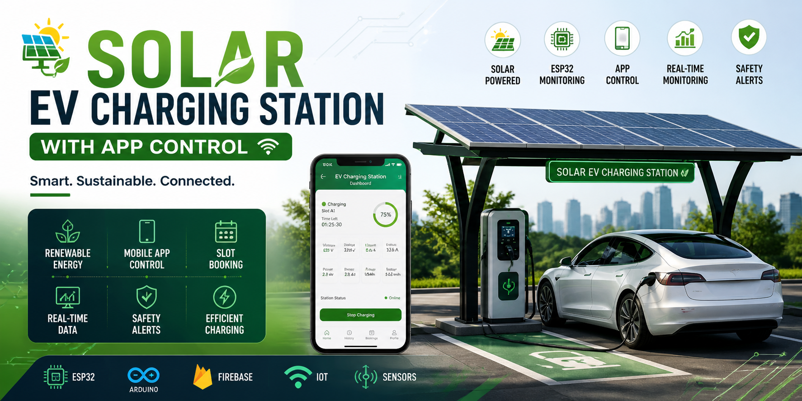
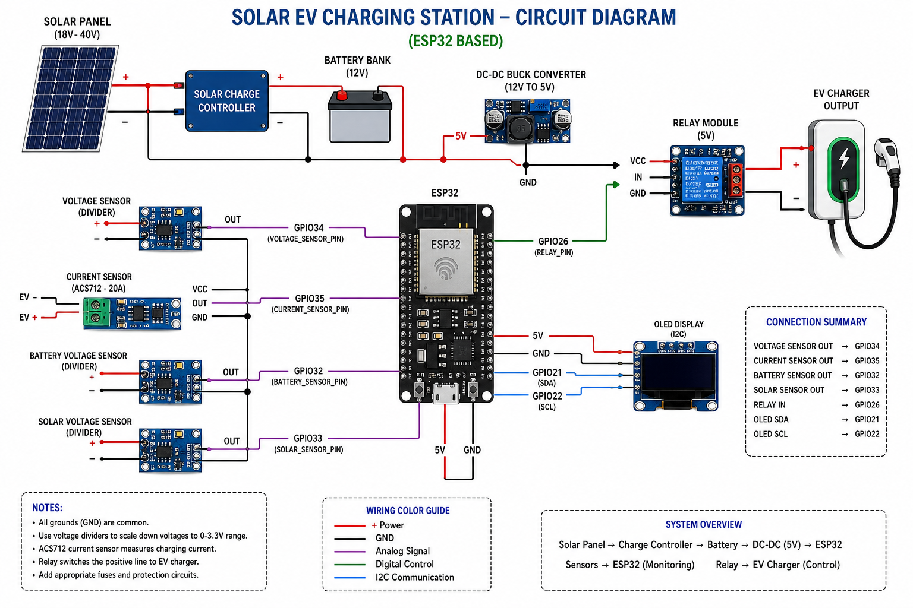
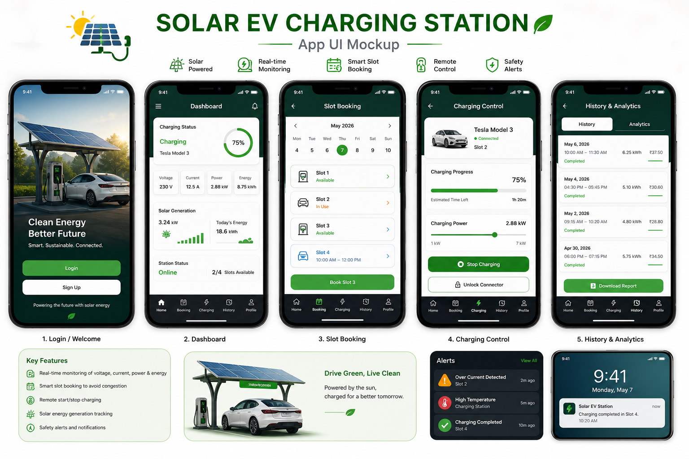

# ⚡ Solar EV Charging Station with App Control

A smart **solar-powered electric vehicle (EV) charging system** integrated with IoT and mobile app control.
This project aims to provide **sustainable, efficient, and intelligent charging** using renewable energy and real-time monitoring.

---

## 📌 Project Overview

With the increasing adoption of electric vehicles, there is a growing need for **eco-friendly charging infrastructure**.
This project utilizes **solar energy + IoT technology** to build a smart EV charging station that allows:

* Remote monitoring
* Smart slot booking
* Energy-efficient charging
* User-friendly mobile control

---

## 🚀 Features

* ☀️ **Solar-Based Charging**
  Uses solar panels to generate clean energy for EV charging

* 📡 **ESP32 Monitoring System**
  Collects real-time data like voltage, current, and battery status

* 📱 **Mobile App Control (Firebase)**
  Users can control charging and monitor data remotely

* 🗓️ **Slot Booking System**
  Avoids congestion by allowing users to book charging slots

* 📊 **Real-Time Monitoring Dashboard**
  Displays live charging data

* ⚠️ **Safety Alerts**
  Detects overcurrent/overheating and sends alerts

---

## 🛠️ Tech Stack

| Component       | Technology               |
| --------------- | ------------------------ |
| Microcontroller | ESP32                    |
| Programming     | Arduino (C/C++)          |
| Backend         | Firebase                 |
| App Control     | Firebase / Web App       |
| Sensors         | Voltage, Current Sensors |
| Communication   | WiFi (IoT)               |

---

## ⚙️ Working Principle

1. Solar panels generate electrical energy
2. Energy is stored or directly supplied to EV
3. ESP32 reads sensor data (voltage/current)
4. Data is sent to Firebase in real-time
5. User interacts via mobile/web app
6. Charging can be controlled remotely
7. Safety system monitors abnormal conditions

---

## 🖼️ Circuit Diagram

## 🖼️ Circuit Diagram

<p align="center">
  
  <br>
  <em>Figure: Circuit Diagram of Solar EV Charging Station</em>
</p>
---

## 📁 Project Structure

```
Solar-EV-Charging-Station-App-Control/
│
├── Arduino_Code/
│   └── solar_ev_charging_station.ino
├── App/
│   └── firebase_app_notes.md
├── Circuit_Diagram/
│   └── circuit_diagram_solar_ev.png
├── Documentation/
│   └── project_description.md
├── Images/
│   └── SolarEV_banner.png
└── README.md
```

---

## 🔧 Installation & Setup

1. Clone the repository:

   ```
   git clone https://github.com/gayatri333-ctrl/solar-ev-charging.git
   ```

2. Open Arduino code in Arduino IDE

3. Install required libraries:

   * WiFi
   * Firebase ESP32
   * Sensor libraries

4. Connect ESP32 and upload code

5. Setup Firebase:

   * Create project
   * Add Realtime Database
   * Add credentials in code

---

## 📊 Applications

* Smart EV charging stations
* Renewable energy systems
* Smart cities infrastructure
* IoT-based energy monitoring

---

## 🔮 Future Scope

* 🔋 **Wireless Charging using Copper Coils**
* 🤖 **AI-Based Energy Optimization**
* 📍 **GPS-Based Nearby Station Detection**
* 💳 **Online Payment Integration**
* 📈 **Predictive Maintenance using ML**

---
## 📱 App UI Preview

<p align="center">
  
  <br>
  <em>Figure: Mobile App Interface for EV Charging System</em>
</p>